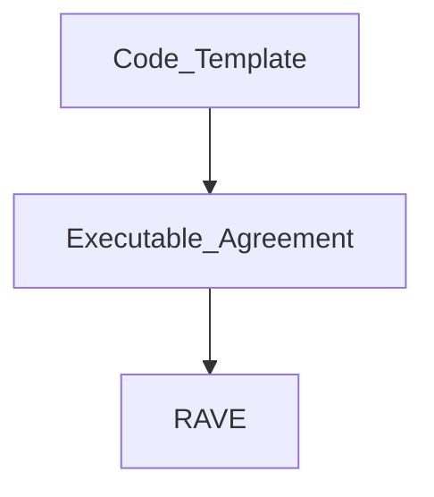

# Intro to RAVEs (Three Layers)

#### links to related docs

- [Test Plan](./1_0_testing_plan.md)
- [HFvZ Setup](../README.md)
- [Phase 1 Testing Details](./1_1_phase_testing_details.md)
- [Intro to RAVEs (Three Layers)](./1_2_three_layers_of_raves.md)
- [Sample Code for Creating RAVEs](./rave_templates)
- [Feedback](https://github.com/orgs/unytco/projects/5/views/1)

**Context:** RAVEs are akin to Blockchain Smart Contracts, but implemented in an agent-centric Holochain approach. Any system which implements Raves will include these three layers for proper usage. 

## 1. Code Template
Publishing Code Templates allows the logic built into Raves to be reused by different people at different times instead of only used once. 

**Template Name:** This would be the Title of your Code Template. Note: names starting with underscores are reserved for system and swimlane use.

**Input Schema:** Needs to be a JSON Schema that can be used to define the expected input into the `execution_code` and can be used to validate the input in the `ExecutableAgreement`

**Execution Code:** This is the code that will be executed for the RAVE. Currently we support executing [RHAI](https://rhai.rs) code. You can find some [example code here](./rave_templates).

**Output Schema:** Similar to the input Schema this needs to be a JSON Schema and would be the expected output of the Execution Code

## 2. Executable Agreement
For the code in a template to become executable, it needs to be bound to certain information about **WHO can execute it, and HOW it gets its inputs**. 

**Executor:** Can this agreement be executed by a 1) a single agent, 2) any agent in a defined role, or 3) any agent.

**Inputs:** The fields defined in the template's Input Schema must be mapped to some source, either: 1) a fixed value, 2) a result of a DHT query, or 3) provided by the executor at runtime. 

## 3. RAVE (Record of Agreement Verifiably Executed)
When an executor runs an agreement, they commit a record of its execution which can be verifed and validated by anyone. It must contain the inputs used, the link to the executable agreement being executed, and the outputs it produced.

### Validation of a RAVE:
**Execution Authority:** This was being executed by an agent who meets the authorization requirements defined in the Executable Agreement

**Input Signature:** The structure of the inputs is validated against the JSON schema for the inputs.

**Input Sources:** The inputs came from the places defined in the Executable Agreement (e.g. links were parked on the correct base for queries, consumable links were not already consumed by prior executions.)

**Output Signature:** The structure of the outputs is validated against the JSON schema for the outputs.

**Output Values:** These are the outputs produced by the executable code processing the provided inputs. Anyone can validate them by passing the inputs shown above into the executable code, they should receive these identical outputs (structured to comply with the output schema).

**Matching Inputs & Outputs:** The number of units included as inputs, must match the total number of units in the outputs. Like the first law of thermodynamics, RAVEs must not create or destroy units.

